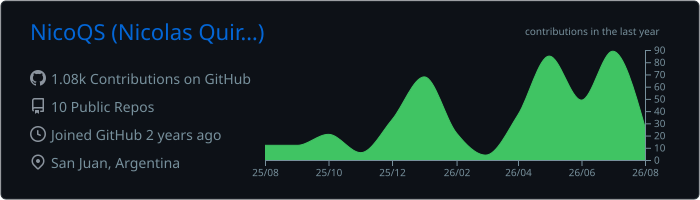
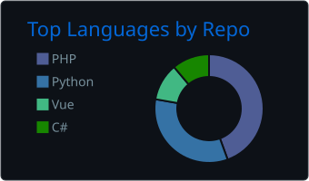
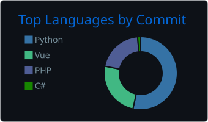
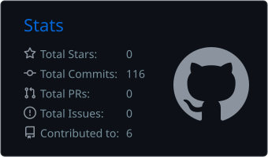
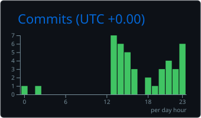

  

  

  

  

 

---

## 👨‍💻 Sobre Mí

Soy **Nicolás**, Técnico Universitario en Programación y estudiante avanzado de la Licenciatura en Ciencias de la Computación en la Universidad Nacional de San Juan.

Mi enfoque principal está en el desarrollo **Backend**, especialmente con **Laravel y PHP**, aunque cuento con experiencia desarrollando soluciones **Full-Stack** e integrando APIs, servicios externos y automatizaciones.

- 🔭 **Experiencia:** Desarrollo de aplicaciones en producción, sistemas de gestión, e-commerce y plataformas SaaS.
- 🛠️ **Especialidad:** Laravel, PHP, FilamentPHP, APIs REST, Vue.js y bases de datos relacionales.
- 🤖 **Automatización:** n8n, agentes de IA, WhatsApp Business API, Webhooks y máquinas de estados.
- 💳 **Integraciones:** Mercado Pago, APIs de terceros, generación de PDFs y notificaciones.
- 🚀 **DevOps:** Docker, Linux, VPS, Nginx y despliegues en producción.
- 🎯 **Objetivo:** Seguir creciendo profesionalmente como Backend Laravel o Full-Stack Developer.

---

## 🚀 Proyectos Destacados

### 🤖 [Blanca Paloma](https://www.blancapalomasrl.com.ar) — Sistema de Gestión + Automatización con IA

> Sistema web y plataforma de gestión para una empresa de transporte y turismo.

- **Stack:** Laravel, Livewire, Flux UI, FilamentPHP, Tailwind CSS, MySQL, n8n, WhatsApp Business API.
- Sitio web institucional y panel administrativo.
- Gestión de rutas, destinos, paquetes turísticos y solicitudes de cotización.
- Autenticación con roles y permisos.
- Chatbot de atención al cliente por WhatsApp integrado con IA.
- Integración de WhatsApp Business API mediante YCloud.
- Máquina de estados determinística para controlar los flujos conversacionales.
- Cotización de rutas interurbanas, paquetes turísticos y alquiler.
- Deduplicación de Webhooks y mecanismos de resiliencia.
- Pausa y derivación a operador humano manteniendo el contexto.
- Migración del modelo de IA de OpenAI a DeepSeek para optimizar costos operativos.

### ⚡ [Electricidad del Este](https://www.edeleste.com) — E-commerce & Sistema de Gestión

> Sistema de gestión comercial y e-commerce desarrollado y desplegado en producción.

- **Stack:** Laravel 12, FilamentPHP, Vue.js, MySQL, Mercado Pago.
- Panel administrativo multinivel.
- Gestión de pedidos, permisos y generación de PDFs.
- Catálogo, búsqueda, carrito y administración de pedidos.
- Integración con Mercado Pago mediante APIs REST y Webhooks.
- Despliegue y mantenimiento en VPS.
- Participación en la optimización y evolución continua de la plataforma.

### 🧩 [TurnexApp](https://www.turnexapp.com) — Plataforma SaaS Multi-tenant

> Plataforma SaaS para gestión integral de turnos y reservas.

- **Stack:** Laravel 12, Vue 3, TypeScript, Inertia.js, FilamentPHP, Tailwind CSS, MySQL.
- Arquitectura multi-tenant.
- Reservas online 24/7.
- Gestión de usuarios, clientes, servicios y reservas.
- Autenticación, roles y permisos.
- Suscripciones integradas con Mercado Pago.
- Subdominios por cliente.
- Arquitectura modular orientada al crecimiento.

---

## 🛠️ Stack Tecnológico

| Backend & DB | Frontend | Automatización & DevOps |
| :--- | :--- | :--- |
|   |   |   |
|    |   |   |
|   |   |  |

---

## 💡 Habilidades Técnicas

<strong>Backend</strong>

 

- APIs RESTful
- Arquitectura MVC
- Autenticación y autorización
- Roles y permisos
- Webhooks
- Rate limiting
- Generación de PDFs
- Notificaciones
- Integración con servicios externos

<strong>Automatización & IA</strong>

 

- n8n
- Agentes de IA
- Integración con LLMs
- WhatsApp Business API
- Máquinas de estados
- Webhooks
- Deduplicación y resiliencia
- Handoff a operadores humanos

<strong>DevOps</strong>

 

- Linux
- Docker
- VPS
- Nginx
- Git
- Despliegue de aplicaciones
- Cron Jobs
- Workers
- Backups

---

## 💼 Experiencia

### Desarrollador Full Stack — Freelance / Equipo
**Octubre 2024 – Actualidad**

Desarrollo de soluciones digitales para pequeños y medianos negocios, participando en el ciclo completo del software: análisis, diseño, desarrollo backend y frontend, integraciones, despliegue y mantenimiento.

### Desarrollador Full Stack Junior — WES
**Pasantía · Mayo 2025 – Julio 2025**

- Desarrollo de funcionalidades para un sistema de control de costos de obras.
- Interfaces y endpoints para el módulo de movilidades.
- Peer review y estimación de tareas.
- Exportación de datos y notificaciones automáticas.

---

## 🎓 Educación

**Licenciatura en Ciencias de la Computación**  
Universidad Nacional de San Juan · 2021 – En curso

**Técnico Universitario en Programación**  
Universidad Nacional de San Juan · 2021 – 2024

---

## 🧪 Otros Proyectos

- **TICO:** Kiosco interactivo de pago desarrollado con Laravel y FilamentPHP.
- **Manga-Shop API:** API REST para gestión de inventario.  
  [Repositorio](https://github.com/NicoQS/manga-shop)
- **Expo Calidad de Vida:** Web informativa.  
  [Visitar](https://exposanjuan.netlify.app/)
- **Tattoo Skills:** Web para estudio de tatuajes.  
  [Visitar](https://barber-tattoo.netlify.app/)
- **Sabores Únicos:** Landing page gastronómica.  
  [Visitar](https://saboresunicos.netlify.app/)

---

## 📊 GitHub Stats

> Las estadísticas se generan mediante GitHub Actions y se almacenan directamente en este repositorio.

  

  

---

📍 San Juan, Argentina • 2026

